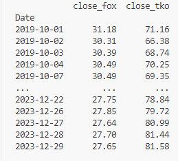
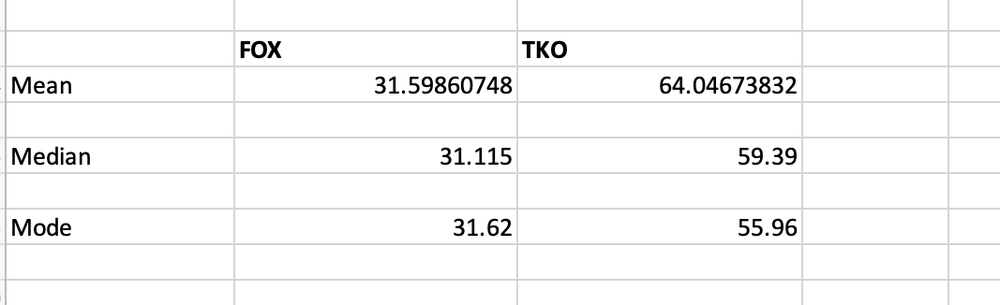
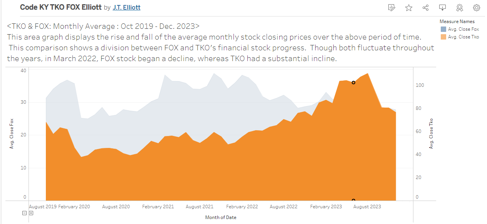
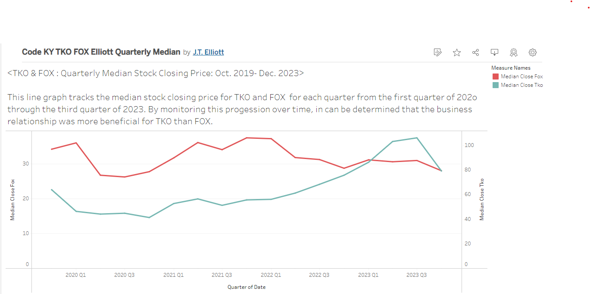

**Overview**

* A data analysis between the stock tickers, TKO and FOX, based upon their media rights deal between 2019-2023. 

**Objective**

* The purpose of this project is to analyze the stock value for both TKO and FOX during their media rights agreement between the years 2019 and 2023. This project will examine each stock’s value over the above described time period to determine if either or both were overvalued or undervalued. By evaluating these stock prices over time, it can be determined if the decisions made in this agreement were prudent choices which benefitted both parties.

**TKO (Formerly WWE)**

* World Wrestling Entertainment (WWE) is a publicly traded company focusing on sports entertainment. WWE focused their corporation in three sectors: media, live events, and consumer products. The media sector focuses on family-friendly television programming with a Parental Guidance (PG) rating.  The company holds over 300 live ticketed events each year. Finally, the consumer products focused on retail merchandise. In September 2023, WWE was sold to Endeavor as a part of TKO Holdings Group and is now traded under the ticker symbol, TKO. 
- [TKO Stock Insights](https://www.marketwatch.com/investing/stock/tko/)
- [TKO Corporate Website](https://tkogrp.com/)

**FOX**

* FOX Corporation is a publicly traded company focusing on various multimedia outlets. FOX Corporations currently distributes produces and distributes content through subsidiary businesses in news, sports, entertainment, television stations, and streaming. FOX is known for having some of the highest rated television shows in politics, athletics, comedy, and drama.
- [FOX Stock Insights](https://www.marketwatch.com/investing/stock/fox)
- [FOX Corporate Website](https://www.foxcorporation.com/)

**History**

* In October 2019, FOX and WWE agreed to a five-year 205 million dollar deal. FOX would pay this amount to WWE for the right to air their television show, Smackdown. At the time of this deal,  WWE’s Smackdown was the sixth largest television audience for shows on cable. Additionally, Smackdown began airing live in 2016 instead of being pre-recorded. As a result of this change, the value for advertising on the show increased. Smackdown’s target demographic is between the age of 18 and 49. This audience demographic is the most desirable group for advertisers. 

**Data Analysis Findings**

* Based upon the evidence discovered though this data analysis, the following conclusions can confidently be made.
    * TKO stock rose $10.42 per share during this time period, indicating a positive correlation.
    * FOX stock declined $3.53 per share during this time period, indicating a negative correlation.
      

* Utilizing inferential statistics, a data analysis reveals noteworthy trends in the financial performance of FOX and TKO during this media rights deal. Remarkably, the mean, median, and mode of FOX exceeded its 2023 closing price. Conversely, TKO demonstrated a contrasting scenario, with its 2023 closing price surpassing both its mean, median, and mode. This indicates that TKO not only outperformed its typical and frequently occurring closing prices but also diverged positively from the statistical norms, marking a notable distinction from FOX's financial trajectory by the end of 2023.

* This project extends its advantages to internal analysts who are deeply invested in the details, as well as external investors seeking comprehensive insights into the dynamics of the companies involved.  Data from this project serves as a valuable tool for establishing a baseline and monitoring the enduring impacts on both companies as their relationship evolves. Additionally, it plays a pivotal role in the analysis conducted during contract negotiations at the time of renewal. External entities may leverage this information to explore potential mergers and assess how media rights influence business earnings.

**Data Visualizations**

*Visualizations of the findings can be viewed at the following Tablaeu Public websites.

- [Area Chart of Monthly Average](https://public.tableau.com/app/profile/j.t.elliott/viz/CODEKYTKOFOXElliottMonthlyAverage/MonthlyAverage)

- [Line Graph of Yearly Median](https://public.tableau.com/app/profile/j.t.elliott/viz/CodeKYTKOFOXElliottQuarterlyMedian/YearlyMedian)

**Requirements**

Before you begin running these files, ensure you have met the following requirements:

1. Create a GitHub account at this [website](https://github.com/)
1. Install VS Code from this [website](https://code.visualstudio.com/)
1. Install Python version 3.12 from this [website](https://www.python.org/downloads/)
1. Install yfinance package 0.2.33 from this [website](https://pypi.org/project/yfinance/)

**Directions for Implementation**

* Follow these steps to run the project on your local machine:

1. Clone the repository.
1. Navigate to the cloned repository.
1. Set up a virtual environment.
1. Install the required packahes from the requirements.txt file.
1. Run the prepare_data.py file.
1. Refer to [Tableau dashboard](https://public.tableau.com/app/profile/j.t.elliott/vizzes) for visualized data.

**Features**
1.	Two CSV files created in a data folder (fox.csv & tko.csv)
      * Merged CSV files into one CSV file (merged_data.csv)
2. 	Data cleaned (rounded closing price to two decimal places, removed unessecary columns)
      * Pandas used in the Dataframe, merged data files, renamed closing value columns to match the tickers. 
3. Visualizations using Tableau displayed in the form of area chart and line graph.
4.	Virtual Environment utilized to help keep dependencies separate.
6.	README with well-written comments and Markdown features
